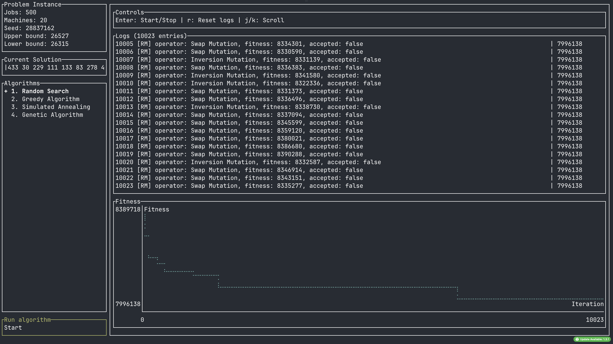
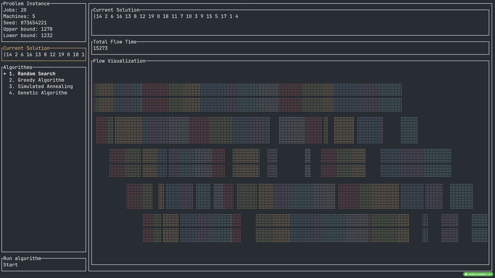

## PFSP Problem Solver

## What is that?

This is a terminal-based UI application that helps you to:

1. Parse PFSP problems
2. Evaluate PFSP solutions in the context of a chosen problem
3. Apply algorithms to optimize your PFSP solution
